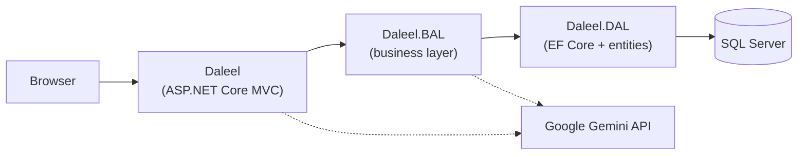

# Daleel — Company Profile, CMS & CRM Platform

A single ASP.NET Core MVC application (.NET 10) that serves three distinct surfaces from one codebase and one SQL Server database:

| Surface | URL prefix | Access | Purpose |
| --- | --- | --- | --- |
| **Public company-profile site** | `/` | Anonymous | Bilingual (EN/AR) marketing site — home, platforms, about, trust, blog, contact, partner registration, demo requests |
| **CMS** | `/cms/*` | `Admin` role | Edits the content the public site renders — brands, services, projects, team, testimonials, articles, page sections, navigation, media, users |
| **CRM** | `/crm/*` | Authenticated | Companies, contacts, leads, deals, activities, follow-up tasks, pipeline board |

An AI chat widget ("Dalily") is embedded on every public page, backed by the Google Gemini API over both HTTP (text) and WebSocket (voice).

---

## Main features

**Public site**
- Full English / Arabic bilingual rendering with RTL layout, driven by a culture cookie.
- Brand-themed: logo, favicon, colours, SEO meta and social cards all come from a `BrandProfile` record selected by a `?brand=` slug (defaults to `daleel`).
- CMS-editable copy on 8 pages via a `PageSection` key/value store, with per-section fallbacks so a blank CMS value never blanks a live page.
- Blog with search, category and tag filters, scheduled publishing and draft preview for signed-in users.
- Three lead-capture forms (Contact, Partner Registration, Schedule Demo) that write directly into the CRM lead table.
- AI chat widget with text and voice modes.

**CMS**
- CRUD for brand profiles, services, projects, team members, testimonials, articles and navigation links — all bilingual, all with publish/draft toggles and soft delete (except articles and navigation, which hard-delete).
- Page-section editor with add/delete of arbitrary section keys.
- Media library over `wwwroot/uploads` with usage detection (finds every entity referencing a file before you delete it) and automatic unlinking on delete.
- User management (create, edit, reset password, activate/deactivate, role assignment).

**CRM**
- Companies, contacts, leads, deals, activities, tasks — each with search, filtering and paging.
- Lead → contact conversion with duplicate-email detection and existing-company matching.
- Kanban pipeline board with drag-and-drop stage changes (AJAX) and a no-JavaScript fallback.
- Dashboard with KPIs, open pipeline value grouped by currency, upcoming tasks and recent activity.

---

## Technology stack

| Concern | Technology |
| --- | --- |
| Runtime / framework | .NET 10 (`net10.0`), ASP.NET Core MVC |
| ORM / data | Entity Framework Core 10.0.11, SQL Server provider |
| Identity | ASP.NET Core Identity (cookie authentication), `IdentityDbContext<ApplicationUser>` |
| Views | Razor views (`.cshtml`) — no SPA framework |
| Styling | Tailwind CSS 3.4 (built via npm), plus `wwwroot/css/site.css` |
| Client JS | Vanilla ES modules-free scripts in `wwwroot/js`; jQuery + jQuery Validation bundled under `wwwroot/lib` |
| Localization | `IStringLocalizer`/`IHtmlLocalizer` over `SharedResource.{en,ar}.resx` + `CookieRequestCultureProvider` |
| HTML sanitizing | `HtmlSanitizer` (Ganss.Xss) 9.2.995 |
| AI | Google Gemini REST + Gemini Live WebSocket API |
| Caching | `IMemoryCache` (page sections, navigation links) |
| Testing | xUnit 2.9.3, FluentAssertions 8.0.1, Moq 4.20.72, EF Core InMemory |
| Container | Docker multi-stage (`mcr.microsoft.com/dotnet/sdk:10.0` → `aspnet:10.0`) |
| CI/CD | GitHub Actions → GHCR → Kubernetes |

> `Mscc.GenerativeAI` 3.1.0 is referenced by `Daleel.BAL` but no code in the repository uses it. See [Known Security Considerations](docs/SECURITY.md#unused-and-dead-code).

---

## Architecture summary

Three projects in a strict one-way dependency chain — a classic **three-layer (N-tier) architecture**, not Clean/Onion/CQRS:



Key rules the code actually enforces:

- Controllers depend only on `Daleel.BAL.Services.Interfaces.I*Service` — never on `ApplicationDbContext`. (Two documented exceptions: `CmsUserController` and `CrmActivityController` inject Identity's `UserManager` directly.)
- `AccountService` wraps `SignInManager` so controllers never touch Identity's sign-in surface.
- Every mutating service method returns `ServiceResult` / `ServiceResult<T>` with three states — success, not-found, or field-level validation errors — which controllers translate into `NotFound()` or `ModelState` entries.
- There is **no repository or unit-of-work layer**; services use `ApplicationDbContext` (which is itself the unit of work) directly.

Full detail: **[docs/ARCHITECTURE.md](docs/ARCHITECTURE.md)**.

---

## Repository structure

```
DaleelCompanProfile-MVC/
├── Daleel/                     ASP.NET Core MVC web project (controllers, views, wwwroot, resources)
├── Daleel.BAL/                 Business layer — services, interfaces, DTOs/inputs/queries
├── Daleel.DAL/                 Data layer — entities, ApplicationDbContext, EF migrations
├── Daleel.Tests/               xUnit test suite (226 tests)
├── docs/                       This documentation
├── Daleel.slnx                 Solution file (XML `.slnx` format, not `.sln`)
├── Dockerfile                  Multi-stage production image
└── .github/workflows/          CI/CD (deploy-prod.yml)
```

Per-directory responsibilities: **[docs/PROJECT-STRUCTURE.md](docs/PROJECT-STRUCTURE.md)**.

---

## Requirements

- **.NET SDK 10.0** (repo verified against `10.0.400`)
- **SQL Server** — LocalDB is fine for development (`(localdb)\mssqllocaldb` is the configured dev default)
- **Node.js + npm** — required only to rebuild Tailwind CSS. No Node version is pinned in the repository.
- **Docker** — optional, for container builds

---

## Installation

```powershell
git clone <repository-url>
cd DaleelCompanProfile-MVC

dotnet restore Daleel.slnx

# Tailwind toolchain (run once, from the web project)
cd Daleel
npm install
cd ..
```

> The web `.csproj` runs `npm run build:css` before every Build, **but only when `Daleel/node_modules` exists**. Skip `npm install` and the target silently does nothing, leaving `wwwroot/css/tailwind.css` stale.

---

## Configuration

Configuration lives in `Daleel/appsettings.json` and `Daleel/appsettings.Development.json`. Three keys matter:

| Key | Purpose |
| --- | --- |
| `ConnectionStrings:DefaultConnection` | SQL Server connection string. Required — startup throws if missing. |
| `CrmSeed:AdminEmail` / `AdminPassword` / `AdminFirstName` / `AdminLastName` | Bootstrap administrator created on first run. If email or password is blank, no admin is seeded. |
| `Gemini:ApiKey` | Google Gemini API key used by the chat widget. If missing, the chat endpoints return `503`. |

**Both `appsettings.json` files are committed to git and currently contain a live SQL Server password and Gemini API keys.** Override them with environment variables (`ConnectionStrings__DefaultConnection`, `Gemini__ApiKey`, `CrmSeed__AdminPassword`) or user-secrets, and rotate the committed credentials. See [docs/SECURITY.md](docs/SECURITY.md).

---

## Database setup

The application **migrates itself on startup** — `CrmInitializer.InitializeAsync` calls `Database.MigrateAsync()`, creates the `Admin` and `Staff` roles, and seeds the bootstrap administrator. Subsequent startup steps seed default page sections, brands, services, projects, team members, testimonials and navigation links if those tables are empty.

All of this is wrapped in try/catch and logged rather than fatal, so the public site still serves when SQL Server is unreachable.

To apply migrations manually:

```powershell
dotnet ef database update --project Daleel.DAL --startup-project Daleel
```

Schema, relationships and lifecycle rules: **[docs/DATABASE.md](docs/DATABASE.md)**.

---

## Running locally

```powershell
dotnet run --project Daleel
```

| Profile | URLs |
| --- | --- |
| `http` | http://localhost:5097 |
| `https` | https://localhost:7220, http://localhost:5097 |

Then sign in to the CRM/CMS at `/crm/account/login` using the `CrmSeed` credentials.

For Tailwind live rebuilds, run in a second terminal:

```powershell
cd Daleel
npm run watch:css
```

Tests:

```powershell
dotnet test Daleel.Tests
```

More commands, debugging notes and single-test filters: **[docs/DEVELOPMENT.md](docs/DEVELOPMENT.md)**.

---

## Docker usage

```powershell
docker build -t daleel-mvc:local .
docker run -p 8080:80 `
  -e "ConnectionStrings__DefaultConnection=<your-connection-string>" `
  -e "Gemini__ApiKey=<your-key>" `
  daleel-mvc:local
```

The image sets `ASPNETCORE_URLS=http://+:80` and `ASPNETCORE_ENVIRONMENT=Production`, exposes port 80, and starts `dotnet Daleel.dll`.

> There is **no `docker-compose.yml`** in this repository — the container expects an external SQL Server. Note also that the Dockerfile does not run `npm install`/`npm run build:css`, so the image ships whatever `wwwroot/css/tailwind.css` was committed.

---

## API overview

The application is server-rendered MVC; almost every route returns HTML. Roughly **140 routed endpoints** exist across 22 controllers. Only six return JSON (two of them only for AJAX callers, redirecting otherwise), and one is a WebSocket:

| Endpoint | Type | Auth |
| --- | --- | --- |
| `POST /api/dalily-chat/text` | JSON | **Anonymous** |
| `GET /ws/dalily-chat` | WebSocket | **Anonymous** |
| `POST /cms/media/api/upload` | JSON | Admin |
| `GET /cms/media/check-usage` | JSON | Admin |
| `POST /cms/navigation/reorder` | JSON | Admin |
| `POST /cms/navigation/toggle-active/{id}` | JSON when `X-Requested-With: XMLHttpRequest`, otherwise redirect | Admin |
| `POST /crm/deals/{id}/move` | JSON when `X-Requested-With: XMLHttpRequest`, otherwise redirect | Authenticated |

Full route table with parameters, responses and behaviour: **[docs/API.md](docs/API.md)**.

---

## Authentication overview

Cookie-based ASP.NET Core Identity. There is **no JWT, no refresh token, no registration flow, and no email confirmation** — accounts are created either by the startup seeder or by an existing admin through `/cms/users/create`.

- Login `/crm/account/login`, logout `/crm/account/logout`, access denied `/crm/account/access-denied`
- Cookie expires after 8 hours with sliding expiration; `HttpOnly`, `SameSite=Lax`
- Passwords: minimum 8 characters, non-alphanumeric not required, unique email required
- Lockout: 5 failed attempts → 15 minutes
- Two roles: `Admin` (CMS + CRM) and `Staff` (CRM only)

Full flow with diagrams and the authorization matrix: **[docs/AUTHENTICATION.md](docs/AUTHENTICATION.md)**.

---

## Deployment overview

Pushing to the `prod` branch triggers `.github/workflows/deploy-prod.yml` on a **self-hosted runner**, which builds the Docker image, pushes it to `ghcr.io/neurix-org/daleel-mvc`, and rolls the `daleel-mvc` deployment in the `daleel` Kubernetes namespace.

A Visual Studio MSDeploy publish profile targeting `site84012.siteasp.net` also exists in the repository, alongside a `daleelai.runasp.net-WebDeploy.publishSettings` file.

Details and caveats: **[docs/DEPLOYMENT.md](docs/DEPLOYMENT.md)**.

---

## Documentation index

| Document | Contents |
| --- | --- |
| [docs/ARCHITECTURE.md](docs/ARCHITECTURE.md) | Layers, dependency flow, DI, middleware pipeline, cross-cutting concerns, runtime flow |
| [docs/API.md](docs/API.md) | Every route, by controller, with parameters and behaviour |
| [docs/DATABASE.md](docs/DATABASE.md) | Entities, relationships, indexes, delete behaviour, soft delete, migrations, seeding |
| [docs/AUTHENTICATION.md](docs/AUTHENTICATION.md) | Identity configuration, login flow, roles, authorization matrix, account lifecycle |
| [docs/DEVELOPMENT.md](docs/DEVELOPMENT.md) | Setup, environment variables, commands, testing, debugging |
| [docs/DEPLOYMENT.md](docs/DEPLOYMENT.md) | Docker, CI/CD, Kubernetes, publish profiles |
| [docs/BUSINESS-FLOWS.md](docs/BUSINESS-FLOWS.md) | End-to-end traces of the major workflows |
| [docs/PROJECT-STRUCTURE.md](docs/PROJECT-STRUCTURE.md) | What lives where and why |
| [docs/SECURITY.md](docs/SECURITY.md) | Known security considerations found while documenting |
| [CLAUDE.md](CLAUDE.md) | Working notes for AI coding assistants |
